# Dátové modelovanie #1 – Kardinality

Oddelenie zamestnáva osoby. Osoba je zamestnaná najviac v jednom oddelení.
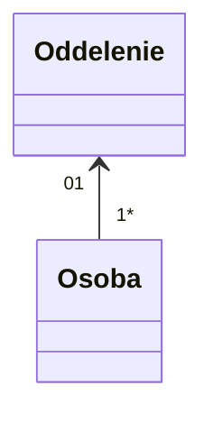

Manažér riadi najviac jedno oddelenie. Oddelenie je riadené najviac jedným manažérom.
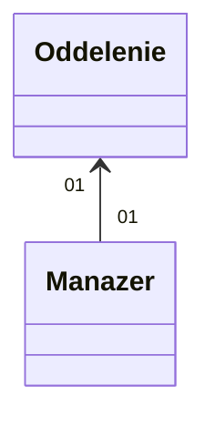

Autor môže napísať veľa článkov. Veľa článkov môže byť napísaných viacerými autormi. Autor článku môže byť neznámy.
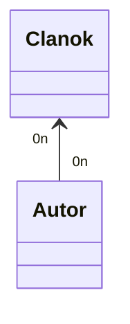

Tím je zložený z viacerých hráčov. Hráč hrá iba za jeden tím. Osoba, ktorá nehrá za tím nie je hráč.

Produkt patrí do viacerých kategórií. Kategória obsahuje veľa produktov. Produkt nemôže existovať bez kategórie.
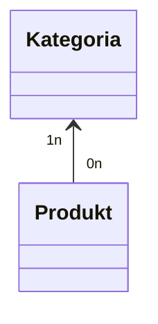

Konkrétny produkt sa predáva v najviac jednej krajine. V krajine sa predáva veľa produktov.
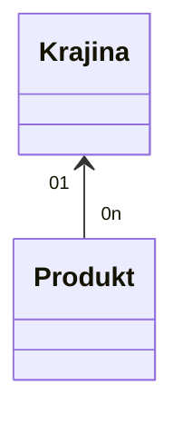

# Dátové modelovanie #2 - Kardinality

V nasledovných diagramoch vysvetlite kardinalitu vzťahov medzi entitami. Určte, ktorý z týchto vzťahov je typu 1:1 a vysvetlite, prečo je vždy potrebné zvážiť vhodnosť použitia takéhoto typu vzťahu. Vysvetlite, akým typom vzťahu by ho bolo vhodné v tomto prípade nahradiť, a prečo

Areal strazi 0 az n straznikov, straznik strazi aspon 1 areal.

Policajt ma 0 alebo 1 zbraj, jednu zbran vlastni 0 az 1 majitelov.

Lekar je lekarom 1 az n pacientov, pacient ma 1 lekara.

Policajt zbran je 1:1. => vzdy treba zvazit preco to nemat ako 1 object.

# Dátové modelovanie #3 - e-shop

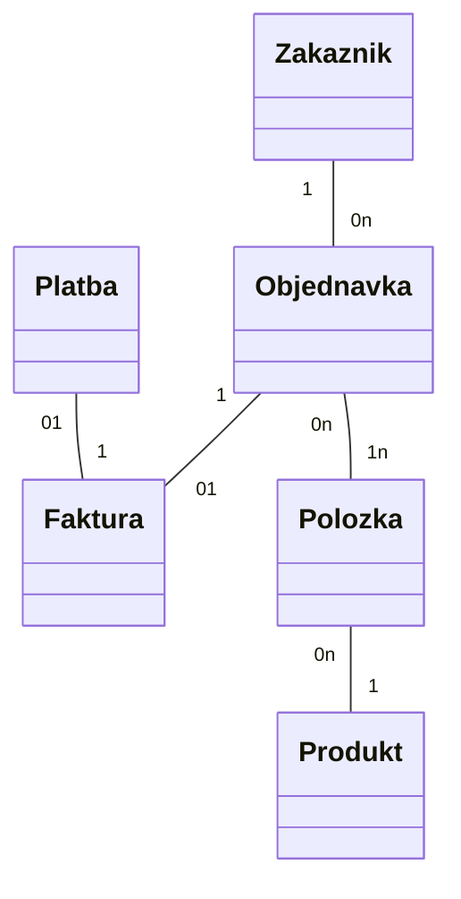

# Dátové modelovanie #4 - Štúdium

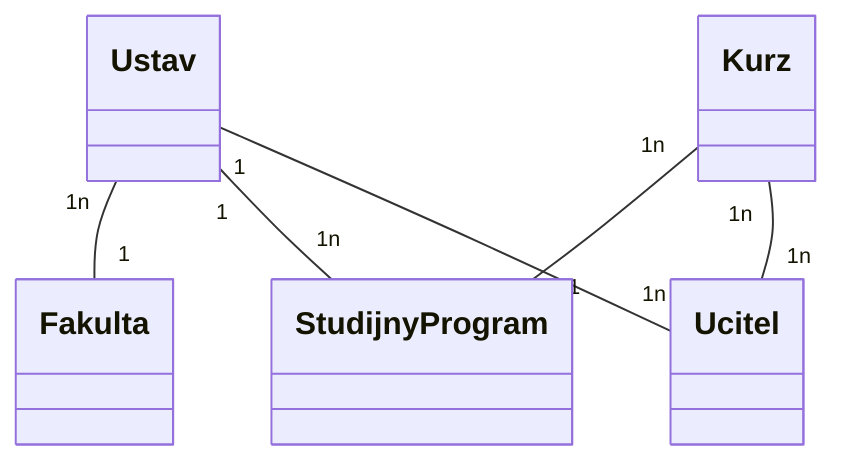

# Dátové modelovanie #5 - Provider

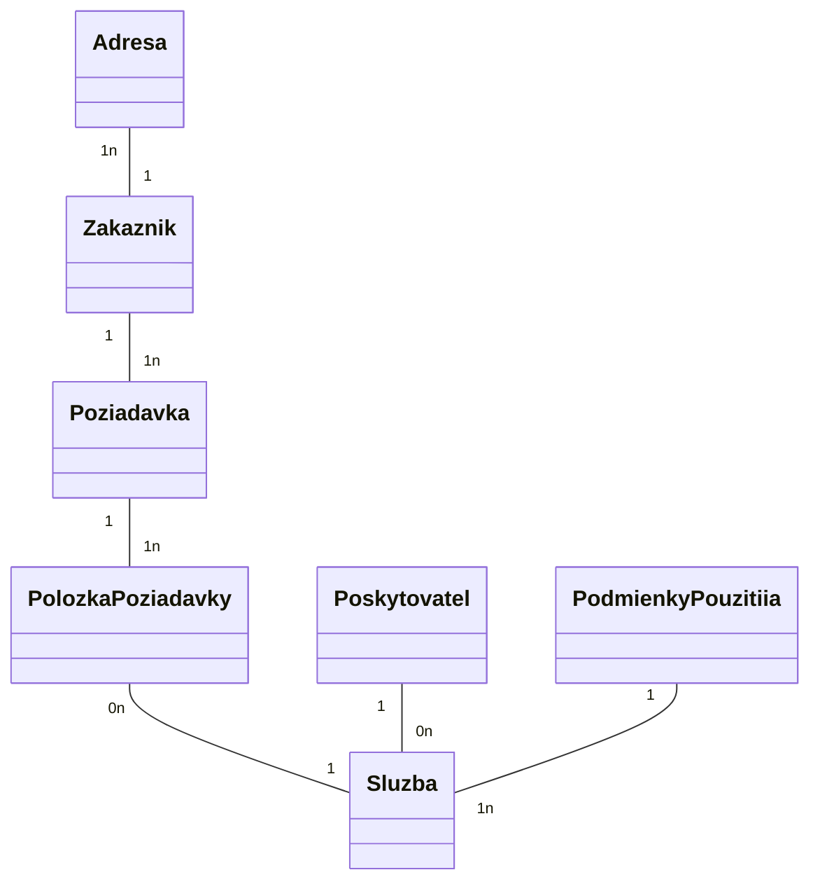

# Dátové modelovanie #6 - Farmaceutická firma

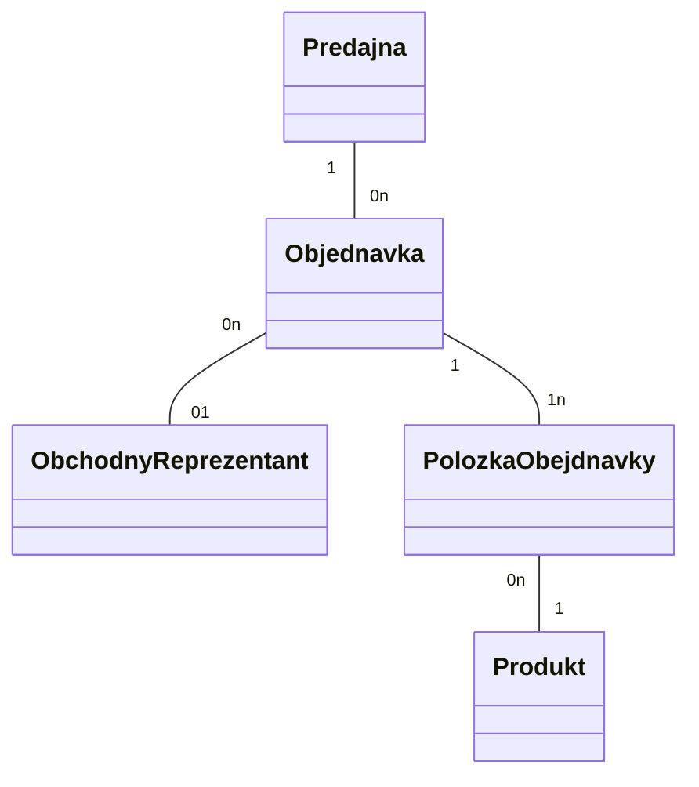

# Dátové modelovanie #7 - Autobusový dopravca

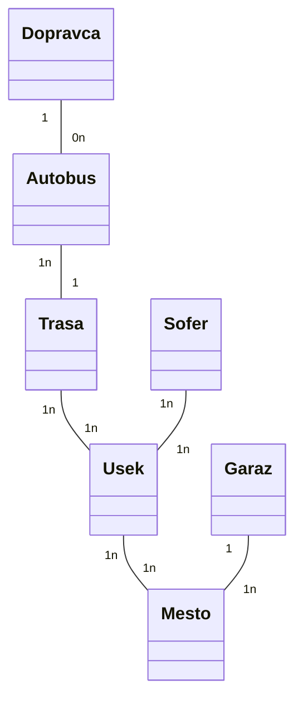

# Dátové modelovanie #8 - Publikácie

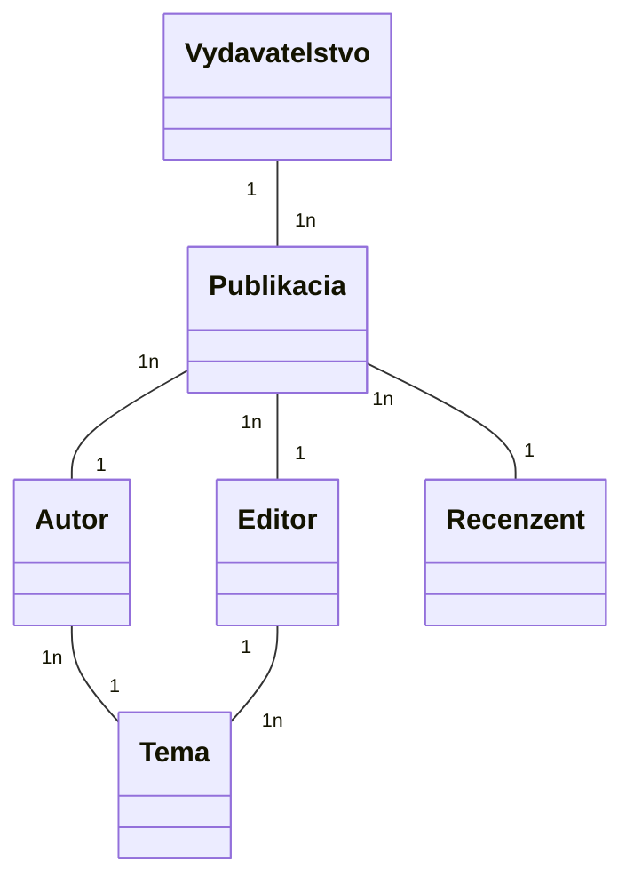

# Dátové modelovanie #9 - Nemocnica

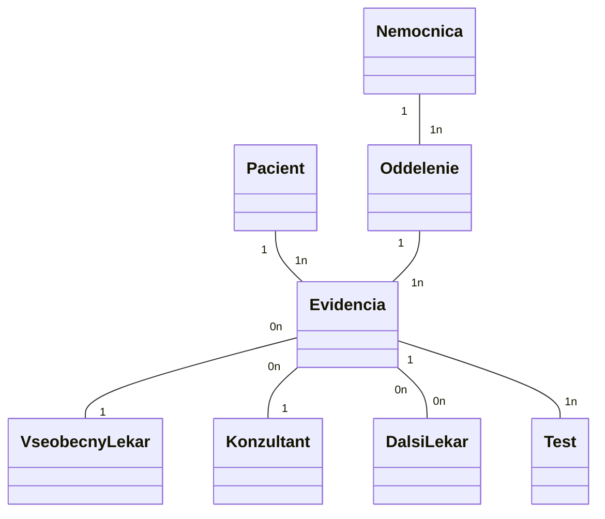

# Dátové modelovanie #10 - Centrum voľného času

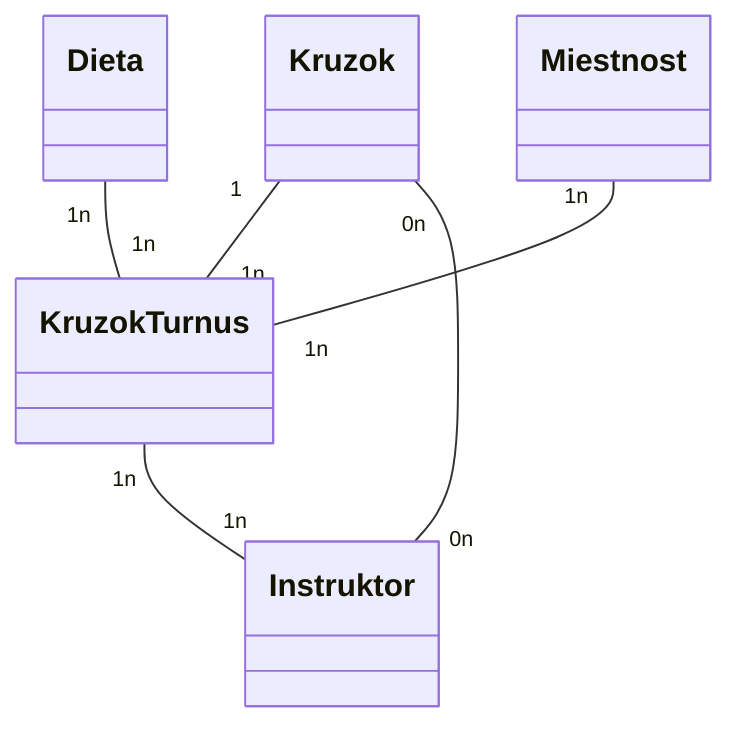