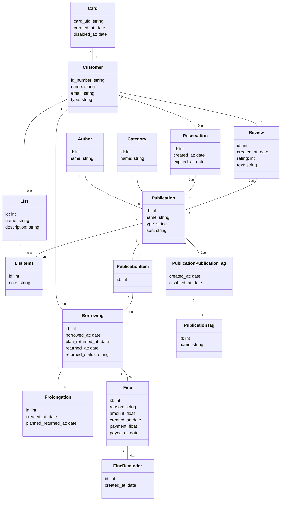
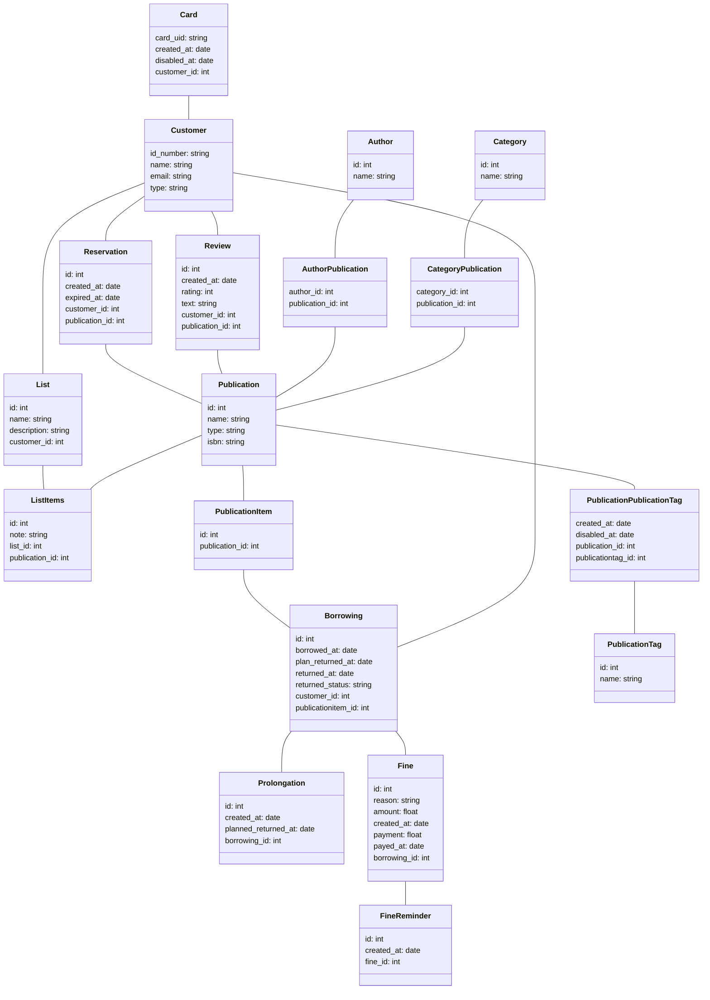

\pagebreak

## **Informácie o práci**

|                  |                                                |
| ---------------- | ---------------------------------------------- |
| **Názov**        | Databázový návrh                               |
| **Úloha**        | Zadanie č. 4                                   |
| **Autor**        | Patrik Fejda                                   |
| **Univerzita**   | Slovenská technická univerzita v Bratislave    |
| **Fakulta**      | Fakulta informatiky a informačných technológií |
| **Predmet**      | DBS_B - Databázové systémy                     |
| **Rok**          | 2022/2023 Letný semester                       |
| **Cvičiaci**     | Ing. Martin Binder                             |
| **Prednášajúci** | Ing. Rastislav Bencel, PhD.                    |
| **Skupina**      | Pondelok 16:00                                 |

\pagebreak

## **Úvod**

todo napis uvod

## **Class diagram**

## **Database model**

## **Opis**

Tento diagram tried zobrazit relácie medzi triedami, ktoré sú bežne používané v knižnici alebo kníhkupectve. Tu je popis jednotlivých tried a ich vzťahov:

Trieda "Card" predstavuje členskú kartu knižnice a má atribúty, ako sú unikátny identifikátor karty, dátum vytvorenia a dátum deaktivácie. Jedna karta môže byť priradená práve jednému zákazníkovi (Customer) a zákazník môže mať priradených viacero kariet.

Trieda "Customer" reprezentuje zákazníka knižnice a obsahuje jeho osobné údaje, ako sú číslo ID, meno, e-mailová adresa a typ zákazníka. Zákazník môže mať viacero požičaných položiek (Borrowing), ale nemusí mať žiadnu.

Trieda "Prolongation" zahŕňa ID, dátum vytvorenia a plánovaný dátum vrátenia.

Trieda "Publication" reprezentuje publikáciu, ktorú knižnica má k dispozícii.
Má atribúty, ako sú identifikátor, názov a typ publikácie, ako aj jej ISBN kód. Publikácia môže mať viacero kópií (PublicationItem), ale nemusí mať žiadnu.

Kniha môže mať aj niekoľko autorov, ktorí sú reprezentovaní triedou "Author". Táto trieda obsahuje atribúty id a name. Kniha môže byť tiež priradená do niekoľkých kategórií, ktoré sú reprezentované triedou Category. Táto trieda obsahuje atribúty id a name. Jeden autor môže mať viacero publikácií a publikácia môže mať viacero autorov.

Triedy "Category" majú ID a názov a vzťahuje sa k publikáciám.

Trieda "PublicationTag" má ID, názov a vzťahuje sa k publikáciám cez medzitriedu "PublicationPublicationTag", ktorá obsahuje dátum vytvorenia a deaktivácie.

Trieda "Fine" obsahuje ID, dôvod, sumu, dátum vytvorenia, platbu a dátum zaplatenia, zatiaľ čo trieda "FineReminder" má len ID a dátum vytvorenia.
Trieda "Fine" predstavuje pokutu za meškanie s vrátením publikácie. Má atribúty, ako sú identifikátor, dôvod pokuty, výška sumy, dátum vytvorenia, platba a dátum zap

Trieda "PublicationItem" reprezentuje konkrétnu kópiu publikácie, ktorá je k dispozícii na požičanie. Má jedinečný identifikátor a môže byť priradená k jednej požičiavke (Borrowing).

Trieda "Category" reprezentuje kategóriu, do ktorej patrí publikácia. Má atribúty, ako je identifikátor a názov kategórie. Jedna kategória môže byť priradená viacerým publikáciám.

Trieda "Borrowing" predstavuje požičanie publikácie z knižnice. Má atribúty, ako sú identifikátor, dátum požičania, plánovaný dátum vrátenia, dátum skutočného vrátenia a stav vrátenia. Požičiavka je prepojená s jednou kópiou publikácie (PublicationItem) a jedným zákazníkom (Customer). Jedna požičiavka môže byť prepojená s viacerými pokutami (Fine).

Trieda Fine obsahuje atribúty id, reason, amount, created_at, payment a payed_at. Každá pokuta môže mať aj niekoľko pripomienok, ktoré sú reprezentované triedou FineReminder, ktorá obsahuje atribúty id a created_at.

Ďalej tu máme triedu "List", ktorá reprezentuje zoznam kníh v knižnici. Obsahuje atribúty id, name a description. Zoznam kníh môže obsahovať množstvo položiek, ktoré sú reprezentované triedou ListItems, ktorá obsahuje atribúty id a note.
Trieda "List" zahŕňa ID, názov a popis zoznamu, kým trieda "ListItems" obsahuje ID a poznámku k položkám na zozname.

Každá rezervácia je reprezentovaná triedou "Reservation", ktorá má atribúty id, created_at a expired_at. Rezervácia môže byť spojená s konkrétnou knihou, ktorá je reprezentovaná triedou Publication. Zákazník, ktorý si rezervoval knihu, je reprezentovaný triedou Customer.

Nakoniec tu máme triedu "Review", ktorá reprezentuje hodnotenie knihy zákazníkom. Má atribúty ako id, created_at, rating a text. Zákazník môže napísať hodnotenie pre konkrétnu knihu, ktorá je reprezentovaná triedou Publication.
